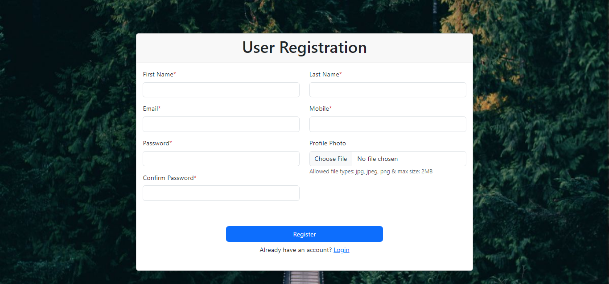
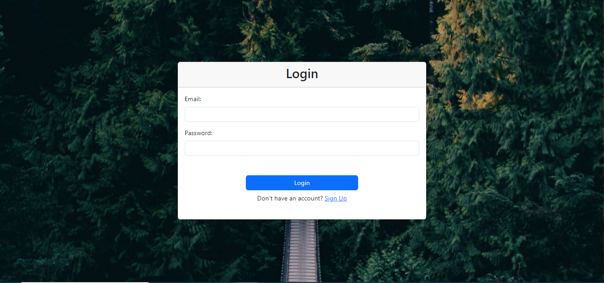
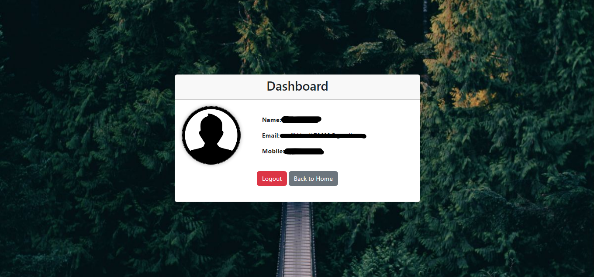

# User Registration and Login System
This project is a simple user registration and login system developed using PHP, HTML, CSS, and JavaScript. It includes features such as user registration, login, logout, profile management, and basic form validations.

# Project Overview
User Registration: Allows users to register by providing necessary information such as first name, last name, email, mobile number, password, and profile photo.
Login: Users can log in using their registered email and password.
Logout: Provides a way for users to securely log out from their accounts.
Form Validations: Includes client-side and server-side form validations for better data integrity.

*Screenshot: Home Page*

*Screenshot: User Registration Page*

*Screenshot: Login Page*

*Screenshot: User Dashboard Page*

# Table of Contents
- [Project Overview](#project-overview)
- [Project Structure](#project-structure)
- [Features](#features)
- [How to Use](#how-to-use)
- [Contributing](#contributing)
- [License](#license)
- [Author](#author)

# Project Structure
The project directory structure is organized as follows:
- e.g.,
user-registration-login-system/    
│    
├── assets/    
│ ├── css/    
│ │ └── style.css    
│ ├── js/    
│ │ └── script.js    
│ ├── img/    
│ └── uploads/    
│    
├── includes/    
│ ├── check_login.php    
│ ├── config.php    
│ ├── dashboard.php    
│ ├── login.php    
│ ├── logout.php    
│ └── register.php    
│    
├── index.html    
├── login.html    
├── README.md    
├── register.html    
└── user_registration_login_system.sql    

# Features
User Registration: Allows users to register by providing necessary information such as first name, last name, email, mobile number, password, and profile photo.
Login: Users can log in using their registered email and password.
Logout: Provides a way for users to securely log out from their accounts.
Profile Management: Users can manage their profiles by updating personal information and changing passwords.
Form Validations: Includes client-side and server-side form validations for better data integrity.

# How to Use
1. Clone the repository to your local machine using Git:
    git clone https://github.com/taufik-khatik/user-registration-login-system.git
2. Set up a local development environment with PHP and a database server (e.g., MySQL, SQLite).
3. Import the provided SQL schema (database.sql) into your database server to create the necessary tables for user data.
4. Update the config.php file in the includes directory with your database credentials.
5. Run the application on your local server (e.g., Apache) and access it through your web browser.

# Contributing
Contributions are welcome! If you have any improvements or new features to suggest, feel free to fork the repository and submit a pull request.

# License
This project is licensed under the MIT License.

# Author
- [Taufik Khatik](https://github.com/taufik-khatik)
